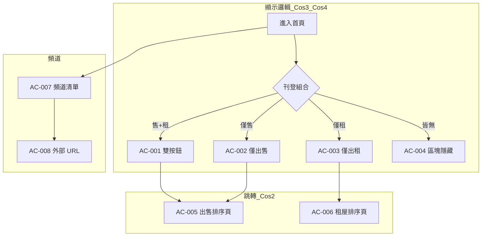

# 驗收標準

> **房仲首頁手動更新與頻道入口**
>
> 需求編號：`PROJ-001` · 使用者故事：房仲於首頁使用手動更新捷徑與各頻道入口

## 覆蓋總覽

| 情境 | 編號 | 優先級 | 摘要 |
|------|------|--------|------|
| Cos-3 雙入口 | AC-001 | 必須 | 同時有售＋租刊登 → 兩個更新按鈕 |
| Cos-3 僅售 | AC-002 | 必須 | 僅有售屋刊登 → 僅出售按鈕 |
| Cos-3 僅租 | AC-003 | 必須 | 僅有租屋刊登 → 僅出租按鈕 |
| Cos-4 全隱藏 | AC-004 | 必須 | 無售租刊登 → 整區不顯示 |
| Cos-2 出售跳轉 | AC-005 | 必須 | 點出售 → 出售更新排序頁 |
| Cos-2 出租跳轉 | AC-006 | 必須 | 點出租 → 租屋更新排序頁 |
| 頻道入口 | AC-007 | 必須 | 列出的房仲頻道皆可見可點 |
| 外部連結 | AC-008 | 必須 | 教育訓練、常見問答開啟正確 URL |
| 非目標 | AC-009 | 必須 | 首頁不內嵌更新操作 |
| 非目標 | AC-010 | 必須 | 不顯示新客／舊客／屋主頻道 |
| Cos-1 待確認 | — | — | 「全部更新」單鈕：本次範圍為雙按鈕，見 UI 矩陣備註 |

---

## 驗收條目一覽

| 編號 | 情境 | 優先級 | 假設 | 當 | 則 | 可測 |
|------|------|--------|------|-----|-----|------|
| AC-001 | Cos-3 | 必須 | 房仲已登入；名下**同時**有售屋與租屋刊登 | 進入首頁 | 顯示手動更新區塊，含「出售物件更新」「出租物件更新」**兩個**獨立按鈕 | ✓ |
| AC-002 | Cos-3 | 必須 | 房仲已登入；**僅有**售屋刊登、無租屋刊登 | 進入首頁 | 顯示區塊與「出售物件更新」按鈕；**不得**出現「出租物件更新」 | ✓ |
| AC-003 | Cos-3 | 必須 | 房仲已登入；**僅有**租屋刊登、無售屋刊登 | 進入首頁 | 顯示區塊與「出租物件更新」按鈕；**不得**出現「出售物件更新」 | ✓ |
| AC-004 | Cos-4 | 必須 | 房仲已登入；名下**無**任何售屋或租屋刊登 | 進入首頁 | **不得**顯示手動更新捷徑區塊（含標題與所有更新按鈕） | ✓ |
| AC-005 | Cos-2 | 必須 | 首頁已顯示「出售物件更新」且可點 | 點擊「出售物件更新」 | 導向既有 APP 原生**出售**更新排序頁；路由與參數符合現行規範 | ✓ |
| AC-006 | Cos-2 | 必須 | 首頁已顯示「出租物件更新」且可點 | 點擊「出租物件更新」 | 導向既有 APP 原生**租屋**更新排序頁；路由與參數符合現行規範 | ✓ |
| AC-007 | 本次包含 | 必須 | 房仲已登入、於首頁 | 檢視頻道快速入口區 | 下列入口皆可見且可點擊：預約客戶、互動訊息、成效追蹤、戰情分析、房產獵人、客戶經營、買屋搜尋、地圖找屋、實價登錄、租屋搜尋、好屋來找你 | ✓ |
| AC-008 | 本次包含 | 必須 | 房仲已登入、於首頁 | 點擊「教育訓練」 | 開啟 `https://event.rakuya.com.tw/campaign/course/` | ✓ |
| AC-009 | 非目標 | 必須 | 房仲已登入、於首頁 | 點擊任一更新按鈕 | 僅跳轉至排序頁；**不得**在首頁內完成物件更新或排序操作 | ✓ |
| AC-010 | 非目標 | 必須 | 使用者為新客、舊客或屋主身份 | 進入首頁 | **不得**出現本次房仲專用之頻道快速入口配置（與房仲版不同） | ✓ |

---

## 驗收條目詳述

### AC-001（必須）— Cos-3 雙入口

- **假設** 房仲已登入；名下同時有售屋與租屋刊登。
- **當** 進入首頁。
- **則** 顯示手動更新區塊，含「出售物件更新」「出租物件更新」兩個獨立按鈕。
- **UI 對照** `homepage-manual-update` 決策表列 1。

### AC-002（必須）— Cos-3 僅售

- **假設** 房仲已登入；僅有售屋刊登、無租屋刊登。
- **當** 進入首頁。
- **則** 顯示「出售物件更新」；不得顯示「出租物件更新」。
- **UI 對照** 決策表列 2。

### AC-003（必須）— Cos-3 僅租

- **假設** 房仲已登入；僅有租屋刊登、無售屋刊登。
- **當** 進入首頁。
- **則** 顯示「出租物件更新」；不得顯示「出售物件更新」。
- **UI 對照** 決策表列 3。

### AC-004（必須）— Cos-4 全隱藏

- **假設** 房仲已登入；無任何售屋或租屋刊登。
- **當** 進入首頁。
- **則** 不提供手動更新捷徑區塊（無標題、無按鈕）。
- **UI 對照** 決策表列 4。

### AC-005（必須）— Cos-2 出售跳轉

- **假設** 「出售物件更新」按鈕可見。
- **當** 點擊該按鈕。
- **則** 進入既有出售更新排序頁；路徑與參數與現行一致（見 Constraints）。
- **UI 對照** `selling-update-entry` 可見 → 導航中。

### AC-006（必須）— Cos-2 出租跳轉

- **假設** 「出租物件更新」按鈕可見。
- **當** 點擊該按鈕。
- **則** 進入既有租屋更新排序頁；路徑與參數與現行一致。
- **UI 對照** `renting-update-entry` 可見 → 導航中。

### AC-007（必須）— 房仲頻道入口清單

- **假設** 房仲已登入、於首頁。
- **當** 檢視並點擊各頻道入口。
- **則** 導向與現行一致（維持舊有導向）；入口皆存在且可點。
- **UI 對照** `agent-channel-links` 靜態清單（賣方 6 ＋ 探索 5，不含本次排除身份）。

### AC-008（必須）— 外部 URL 頻道

- **假設** 房仲已登入、於首頁。
- **當** 點擊「教育訓練」或「常見問答」。
- **則** 分別開啟指定活動 URL（課程頁、LINE FAQ 頁）。

### AC-009（必須）— 非內嵌操作

- **假設** 房仲使用更新捷徑。
- **當** 完成點擊流程。
- **則** 僅跳轉；首頁不提供更新排序之操作 UI。

### AC-010（必須）— 排除其他身份

- **假設** 使用者非房仲身份（新客／舊客／屋主）。
- **當** 進入首頁。
- **則** 不套用本次房仲頻道快速入口配置。

---

## 建議測試資料

| 案例 | 售屋刊登 | 租屋刊登 | 預期 AC |
|------|:--------:|:--------:|---------|
| A | ✓ | ✓ | AC-001、AC-005、AC-006 |
| B | ✓ | ✗ | AC-002、AC-005 |
| C | ✗ | ✓ | AC-003、AC-006 |
| D | ✗ | ✗ | AC-004 |

---

## 流程總覽

---

## 與 UI 狀態矩陣對照

| 驗收編號 | UI 狀態矩陣章節 |
|----------|-----------------|
| AC-001～004 | 決策表：手動更新捷徑區塊顯示邏輯 |
| AC-005 | 出售物件更新入口 |
| AC-006 | 出租物件更新入口 |
| AC-007～008 | 房仲頻道快速入口 |

---

<!-- alignx:generated source=532d881aac85 generator=acceptance-criteria@0.1.0 manual-revision -->
