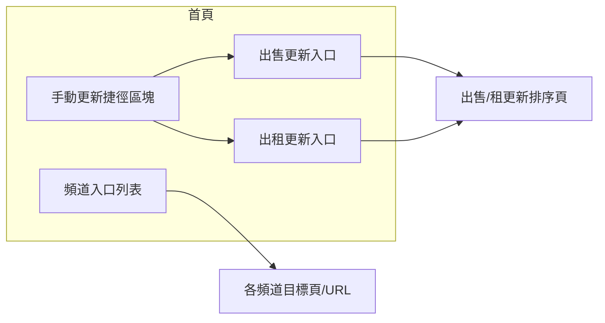
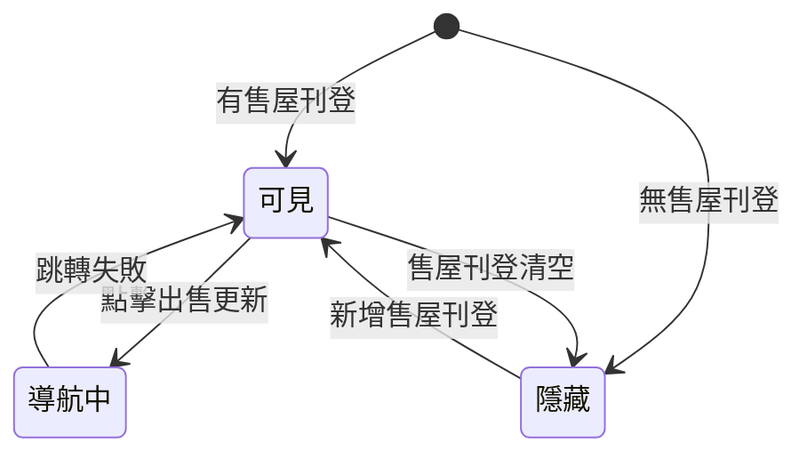
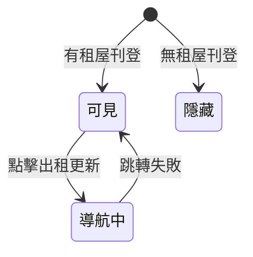

# UI 狀態矩陣

> **房仲首頁手動更新與頻道入口**
>
> 需求編號：`PROJ-001` · 對應 Cos-1～Cos-4、首頁更新捷徑與房仲頻道入口

## 總覽

| Surface ID | 名稱 | 類型 | 對應情境 |
|------------|------|------|----------|
| `homepage-manual-update` | 首頁－手動更新捷徑區塊 | 決策＋穩態 | Cos-3、Cos-4 |
| `selling-update-entry` | 出售物件更新入口 | 狀態機 | Cos-2、Cos-3 |
| `renting-update-entry` | 出租物件更新入口 | 狀態機 | Cos-2、Cos-3 |
| `agent-channel-links` | 房仲頻道快速入口 | 靜態清單 | 本次包含－各頻道 |

---

## 決策表：手動更新捷徑區塊顯示邏輯

**進入條件：** 已登入、身份為房仲、進入首頁。

| 有售屋刊登 | 有租屋刊登 | 區塊顯示（使用者所見） | 對應 |
|:--:|:--:|----------------|------|
| ✓ | ✓ | 區塊標題 ＋「出售物件更新」「出租物件更新」兩個按鈕 | Cos-3 |
| ✓ | ✗ | 區塊標題 ＋ 僅「出售物件更新」按鈕 | Cos-3 |
| ✗ | ✓ | 區塊標題 ＋ 僅「出租物件更新」按鈕 | Cos-3 |
| ✗ | ✗ | **整區不顯示**（無標題、無按鈕） | Cos-4 |

> **備註（Cos-1）：** 需求敘述有「全部更新」單一按鈕情境；**本次包含**為售／租兩個獨立入口。若產品要同時支援「全部更新」，需另增 surface 或按鈕列，不在本表四種組合內。

---

## 首頁－手動更新捷徑區塊（`homepage-manual-update`）

**類型：** 區塊級顯示結果（由上表決策，非操作流程狀態機）

| 穩態 | 說明 | 使用者所見 |
|------|------|------------|
| **雙入口** | 同時有售屋與租屋刊登 | 出售＋出租兩個按鈕 |
| **僅售** | 僅有售屋刊登 | 僅「出售物件更新」 |
| **僅租** | 僅有租屋刊登 | 僅「出租物件更新」 |
| **隱藏** | 無任何售／租刊登 | 區塊不存在 |

---

## 出售物件更新入口（`selling-update-entry`）

**進入條件：** 決策表結果為含「出售」按鈕之一（雙入口或僅售）。

| 狀態 | 說明 | 使用者所見 | 可執行動作 |
|------|------|------------|------------|
| **可見** | 帳號下有售屋刊登 | 「出售物件更新」按鈕可點 | 點擊按鈕 |
| **隱藏** | 無售屋刊登 | 不顯示此按鈕 | — |
| **導航中** | 點擊後跳轉 | 過場／載入（依 APP 慣例） | — |
| **錯誤** | 路由或參數異常（罕見） | 錯誤提示或停留原頁 | 重試、回上一頁 |

### 狀態轉換

| 來源 | 目標 | 觸發 |
|------|------|------|
| 可見 | 導航中 | 使用者點擊「出售物件更新」 |
| 導航中 | （離開本 surface） | 成功開啟「出售更新排序頁」 |
| 導航中 | 錯誤 | 跳轉失敗 |
| 錯誤 | 可見 | 使用者關閉錯誤並返回首頁 |
| — | 隱藏 | 帳號刊登條件變更（無售屋） |

### 狀態圖

**跳轉目標：** 既有 APP 原生「出售更新排序頁」（路由與參數沿用現行，見 Constraints）。

---

## 出租物件更新入口（`renting-update-entry`）

**進入條件：** 決策表結果為含「出租」按鈕之一（雙入口或僅租）。

| 狀態 | 說明 | 使用者所見 | 可執行動作 |
|------|------|------------|------------|
| **可見** | 帳號下有租屋刊登 | 「出租物件更新」按鈕可點 | 點擊按鈕 |
| **隱藏** | 無租屋刊登 | 不顯示此按鈕 | — |
| **導航中** | 點擊後跳轉 | 過場／載入 | — |
| **錯誤** | 跳轉失敗 | 錯誤提示 | 重試 |

### 狀態轉換

| 來源 | 目標 | 觸發 |
|------|------|------|
| 可見 | 導航中 | 使用者點擊「出租物件更新」 |
| 導航中 | 可見 | 跳轉失敗 |
| — | 隱藏 | 無租屋刊登 |

### 狀態圖

**跳轉目標：** 既有 APP 原生「租屋更新排序頁」。

---

## 房仲頻道快速入口（`agent-channel-links`）

**類型：** 靜態清單（無狀態機；進入首頁即顯示，點擊後導向）

**進入條件：** 已登入房仲身份、於首頁。

### 賣方／經營相關

| 入口 | 導向 | 備註 |
|------|------|------|
| 預約客戶 | 維持舊有導向 | 本次不變 |
| 互動訊息 | 維持舊有導向 | 本次不變 |
| 成效追蹤 | 維持舊有導向 | 本次不變 |
| 戰情分析 | 維持舊有導向 | 本次不變 |
| 房產獵人 | 維持舊有導向 | 本次不變 |
| 客戶經營 | 維持舊有導向 | 本次不變 |
| 教育訓練 | https://event.rakuya.com.tw/campaign/course/ | 外部連結 |
| 常見問答 | https://event.rakuya.com.tw/event/lineOaFaq/?page=1-1 | 外部連結 |

### 買屋／租屋探索

| 入口 | 導向 | 備註 |
|------|------|------|
| 買屋搜尋 | 維持舊有導向 | 本次不變 |
| 地圖找屋 | 維持舊有導向 | 本次不變 |
| 實價登錄 | 維持舊有導向 | 本次不變 |
| 租屋搜尋 | 維持舊有導向 | 本次不變 |
| 好屋來找你 | 維持舊有導向 | 本次不變 |

> **本次不包含：** 新客、舊客、屋主身份的頻道入口；首頁內嵌完成更新操作（僅跳轉捷徑）。

---

## 與驗收標準對照（建議）

| 情境 | 建議對應 AC 測試重點 |
|------|----------------------|
| Cos-3 僅售／僅租／雙入口 | 決策表四列＋實機截圖 |
| Cos-4 全隱藏 | 決策表第四列 |
| Cos-2 點擊跳轉 | 出售／出租入口「導航中」→ 目標頁 |
| 頻道列表 | 上表每一列點擊導向正確 |

---

<!-- alignx:generated source=532d881aac85 generator=ui-state-matrix@0.1.0 manual-revision -->
